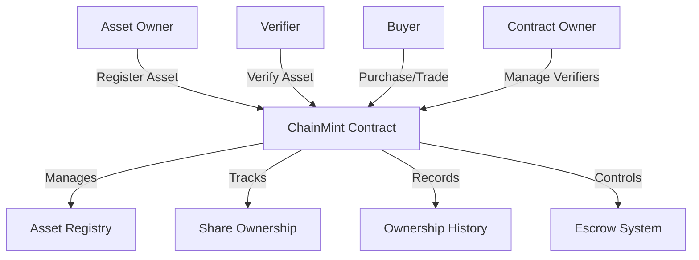

# ChainMint Physical Asset Tokenization

A comprehensive platform for tokenizing physical assets on the Stacks blockchain, enabling fractional ownership, transparent trading, and secure asset verification.

## Overview

ChainMint enables asset owners to create digital representations of physical items like real estate, art, precious metals, and collectibles. The platform supports:

- Complete asset tokenization with ownership tracking
- Fractional ownership capabilities
- Verified asset registration through authorized partners
- Secure escrow-based trading
- Royalty and platform fee management
- Comprehensive ownership history

## Architecture

The system is built around a main contract that handles all core functionality for asset tokenization and trading.



### Core Components

1. **Asset Registry**: Stores all tokenized asset information
2. **Share Management**: Handles fractional ownership
3. **Verification System**: Manages authorized verifiers
4. **Trading Engine**: Facilitates secure transfers through escrow
5. **History Tracking**: Maintains complete ownership records

## Contract Documentation

### Main Contract: chainmint.clar

The main contract manages all platform functionality:

#### Key Features

- Asset registration and management
- Fractional ownership system
- Verified asset tracking
- Escrow-based trading
- Ownership history recording
- Fee and royalty management

#### Access Control

- Contract Owner: Can manage verifiers and platform settings
- Asset Owners: Can modify their assets and initiate transfers
- Verifiers: Can validate registered assets
- General Users: Can purchase and trade assets

## Getting Started

### Prerequisites

- Clarinet
- Stacks wallet
- STX tokens for transactions

### Basic Usage

1. **Register an Asset**:
```clarity
(contract-call? .chainmint register-asset 
    "Asset Description" 
    "Asset Type" 
    "Location" 
    value 
    is-fractional 
    total-shares 
    royalty-percent 
    "metadata-url")
```

2. **Verify an Asset**:
```clarity
(contract-call? .chainmint verify-asset asset-id)
```

3. **Transfer Asset**:
```clarity
(contract-call? .chainmint transfer-asset asset-id recipient)
```

## Function Reference

### Asset Management

```clarity
(register-asset description asset-type location valuation is-fractional total-shares royalty-percent metadata-url)
(update-asset-metadata asset-id description location valuation metadata-url)
(retire-asset asset-id)
```

### Trading Functions

```clarity
(create-asset-escrow asset-id buyer price expiration-blocks)
(create-shares-escrow asset-id buyer shares price expiration-blocks)
(complete-escrow escrow-id)
(cancel-escrow escrow-id)
```

### Ownership Management

```clarity
(transfer-asset asset-id recipient)
(transfer-shares asset-id recipient share-count)
```

## Development

### Testing

1. Clone the repository
2. Install Clarinet
3. Run tests:
```bash
clarinet test
```

### Local Development

1. Start Clarinet console:
```bash
clarinet console
```

2. Deploy contract:
```bash
clarinet deploy
```

## Security Considerations

### Asset Verification
- Only authorized verifiers can validate assets
- Verification status is permanent and immutable

### Trading Safety
- All trades use escrow for security
- Automatic fee and royalty calculations
- Built-in expiration for escrow transactions

### Ownership Protection
- Strict ownership checks
- Asset locking during escrow
- Prevention of double-spending shares

### Limitations
- Maximum of 1,000,000 shares per asset
- Maximum 50% royalty rate
- No direct STX refunds
- Locked assets cannot be transferred or modified